A 5.0 Spectral Mapping
======================

P. Lewis and M. van Leeuwen

UCL/NCEO

31st May 2016

A5.1 Introduction
-----------------

The QA4ECV 'A' approach aims to provide an optimal estimate of the
parameters of a linear model (and their uncertainty) that allow
estimation of albedo are related reflectance terms at over set of
spectral basis functions. In the original work, we defined three broad
waveband responses for albedo, being Visible, Near Infrared , and total
shortwave. In this section, we demonstrate how this can be extended to
other spectral bases.

The algorithm requires that datasets from the set of heterogeneous
sensors are mapped to a common spectral basis. This is permissible
because we are using linear models throughout, i.e. for spectral and
angular modelling. In this section, we derive an initial estimate of
appropriate spectral mapping functions using a spectral database
provided by DLR.

This involves:

1. Applying bandpass functions to the spectra to simulate spectra for
   particular sensors
2. 

A5.2 The database spectra
-------------------------

The spectral database used here is the same as that used in a precious
ESA ADAM study.

This is intended to provide a proof of concept of the approach, and will
ideally be replaced by a wider dataset at a later point.

We can examine the types of data contained in the database:

.. code:: python

    # read the vegetation spectra from DLR database
    spectra_fn = './../dump/spectra/Spectres.sav'
    spectra = scipy.io.readsav(spectra_fn)
    swl = spectra.wl
    spect = spectra.spectres
    types = spectra.type
    
    print types

.. parsed-literal::

    ['a1' 'brachypodium x' 'dry vegetation' 'genista retamoides/umbellata (?)'
     'genista umbellata (?)' 'genista umbellata (?)Description'
     'opuntia ficus-indica (dead black part)'
     'opuntia ficus-indica (dead part)'
     'opuntia ficus-indica (dead white part)'
     'opuntia ficus-indica (green part/ vertical)'
     'opuntia ficus-indica (greener part)' 'opuntia ficus-indica (vertical)'
     'palmite humilis' 'palmite humilis (green part)' 'palmite humilis (tronc)'
     'periploca laevigata' 'phlomis lichnytis (?)' 'plant'
     'rhamnus yclodes (?)' 'stipa tenacissius' 'stipa tenacissius (dead part)'
     'thymus hyemalis' 'ulex parviflorus' 'black lichen (on rock)'
     'black lichen on soil' 'black soil lichen' 'black soil lichen crust. soil'
     'green lichen (right same rock surface as 11a)' 'green lichen on rock'
     'green lichen on rockDescription'
     'green lichen on rockDescriptionDescription'
     'grey lichen (middle same rock surface as 11a)' 'grey lichen on stone'
     'mix orange/white lichen&rock surf' 'orange lichen (left on rock surface)'
     'orange lichen on rock' 'orange lichen/ stone'
     'rock with white lichen (zoom?)' 'rock/ organge and black lichens'
     'white lichen/ some black soil' 'yellow-greenish lichen (desert varnish?)'
     'zoom black lichens' 'zoom orange lichen (rock surface)'
     'artemisia barrelieri(?)' 'brachypodium' 'carduus x (purple flower)'
     'genista umbellata(?)' 'genista umbellata(?) (with flowers)'
     'genista umbellata(?) (with fruits)' 'opuntia ficus-indica'
     'opuntia ficus-indica (dead)' 'palmite humilis'
     'palmite humilis (green part)' 'pasture (annuals)' 'periploca laevigata'
     'phlomis lichnytis(?)' 'phlomis lichnytis(?) (may be huzy)'
     'rhamnus yclodes(?)' 'stipa tenacissius' 'thymus hyemalis'
     'ulex parviflorus' 'ulex parviflorus (alive)'
     'ulex parviflorus (plant is dead)' 'unknown plant' 'yellow flowers'
     'ziziphus lotus' 'wheat row a' 'Meadow'
     'laboratory measurement of fresh healthy cress' 'triticale'
     'Acacia hebeclada' 'Acacia mellifera mit Blaetter'
     'Acacia mellifera ohne Blaetter' 'Acacia reficiens ohne Blaetter'
     'Acacia tortilis mit viel gruen wenig dornen' 'Catophractis alexandri'
     'Commiphora pyracanthoides' 'Grassstreifen am Ufer' 'Grewia flava'
     'Leucosphaera bainsii' 'Leucosphaera bainsii (fast) ohne Blueten'
     'Monechma genistifolia' 'Stipagrostis uniplumis' 'Streu aus Agrostis sp.'
     'Totholzbaum' 'acacia reficiens ohne blaetter'
     'grauroter Busch ohne Blaetter' 'roter Grashorst' 'Acacia mellifera'
     'Acacia mellifera / Streu' 'Acacia mellifera / dicht' 'Acacia reficiens'
     'Acacia reficiens ohne Blaetter L4' 'Acacia tortilis' 'Boscia albitrunca'
     'Boscia albitrunca semifrisch' 'Boscia altitrunca' 'Combretum sp.'
     'Eragrostis c.f. rotifer' 'Eragrostis rigidor'
     'Grastuff trocken / strohgelb' 'Lycium oxycarpum' 'Monechma genistifolia'
     'Rhigozum trichotomum' 'Stipagrostis uniplumis' 'Totholz'
     'acacia mellifera ohne blaetter' 'acacia reficiens ohne blaetter'
     'stipagrostis uniplumis' 'rape' 'fresh meadow' 'winter wheat'
     'dry grasland' 'grasland' 'rape/ vegetation cover approx. 20-30%'
     'rape/ vegetation cover approx. 50%' 'winter wheat stubbles' 'tundra'
     'tundra' 'tundra' 'tundra' 'tundra' 'tundra' 'tundra' 'tundra' '' '' '' ''
     '' '' '' '' '' '' '' '' '' '' '']

.. code:: python

    for i in [10,15,33,45,-18]:
        plt.figure(figsize=(15,3))
        plt.plot(swl,spect[i])
        plt.xlim(swl[0],swl[-1])
        plt.xlabel('wavelength / nm')
        plt.title(types[i])

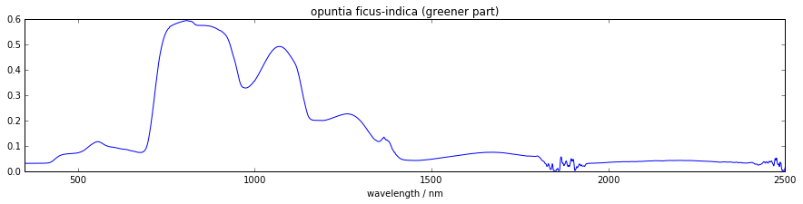

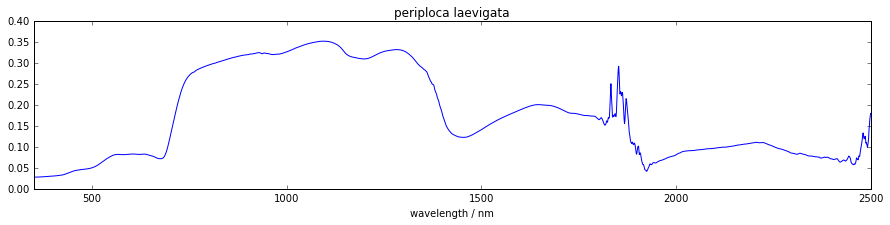

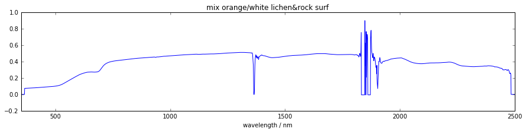

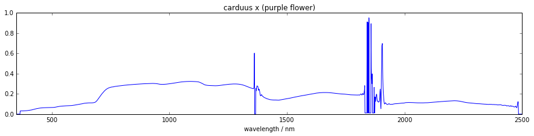

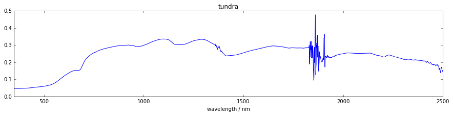

A5.3 Applying bandpass functions to the database spectra.
---------------------------------------------------------

We develop an integration function that takes two dictionaries where the
first holds a spectrum, e.g. of vegetation, and the other holds the
bandpass

.. code:: python

    import numpy as np
    from scipy.interpolate import interp1d
    import scipy, scipy.io
    import matplotlib.pyplot as plt
    import os, glob, pickle
    
    import numpy as np
    import scipy
    import matplotlib.pyplot as plt
    from mpl_toolkits.mplot3d import Axes3D
    import datetime
    import spectral.io.envi as envi
    
    import pickle
    %matplotlib inline

.. code:: python

    def integrate(spectrum, bandpass, minimum, maximum, dlambda):
        r = interp1d(spectrum['wavelength'], spectrum['reflectance'], bounds_error=False, fill_value=0)
        b = interp1d(bandpass['wavelength'], bandpass['rsr'], bounds_error=False, fill_value=0)
        
        d = np.arange(minimum, maximum, dlambda)
        integral = np.sum(r(d) * b(d) * dlambda)
        bsum = np.sum(b(d) * dlambda)
        norm = integral / bsum
        return norm

We will make a dictionary that holds for every sensor (i.e. MERIS,
Terra, Aqua, Sentinel 2) an array of m x n where m is the number of
vegetation spectra (from DLR) and n is the number of wavebands
associated with the sensor. Each element of this array holds the
vegetation reflectance integrated over the bandpass, i.e., the relative
spectral response curve. In addition, for each sensor we also create a
list of centre wavelengths corresponding to the array columns.

.. code:: python

    # read the bandpasses
    bandpass_fn = './../dump/rsr/rsr.dump'
    bandpass_f = open(bandpass_fn, 'r')
    rsr = pickle.load(bandpass_f)
    bandpass_f.close()
    
    # prepare a dictionary holding arrays of m x n (no. of spectra x no. of bands) for each sensor
    integrated_spectra = {}
    
    m = np.shape(spect)[0]
    n_meris = len(rsr['meris']['c1'].keys())
    n_terra = len(rsr['terra']['c1'].keys())
    n_aqua = len(rsr['aqua']['c1'].keys())
    n_sentinel2 = len(rsr['sentinel2']['c1'].keys())
    n_vgt = len(rsr['vgt']['c1'].keys())
    
    integrated_spectra['meris'] = np.zeros((m, n_meris), dtype=float)
    integrated_spectra['terra'] = np.zeros((m, n_terra), dtype=float)
    integrated_spectra['aqua'] = np.zeros((m, n_aqua), dtype=float)
    integrated_spectra['sentinel2'] = np.zeros((m, n_sentinel2), dtype=float)
    integrated_spectra['vgt'] = np.zeros((m, n_vgt), dtype=float)
    
    # populate the dictionary with vegetation spectra integrated over the sensor bandpasses
    c = 'c1' # fix the camera/channel
    for sensor in ['meris', 'terra', 'aqua', 'sentinel2', 'vgt']:
        bands = rsr[sensor][c].keys()
        # create a new/empty array and centre wavelength list
        integrefl = np.zeros((m, len(bands)), dtype=float)
        cwls = []
        for band in range(1, len(bands)+1 ):
            wl = rsr[sensor][c]['band%s' % band]['wavelength']
            relresp = rsr[sensor][c]['band%s' % band]['rsr']
            cwls.append( rsr[sensor][c]['band%s' % band]['cwl'] )
            bandpass = {'wavelength': wl, 'rsr': relresp}
            for i in range(m):
                refl = spect[i, :]
                spectrum = {'wavelength': swl, 'reflectance': refl}
                integrefl[i,band-1] = integrate(spectrum, bandpass, 300, 2500, 1.0)
        
        cwls = np.asarray(cwls)
        integrated_spectra[sensor] = {'integrefl': integrefl, 'cwls': cwls}

And we visualize the results...

.. code:: python

    sensor = 'terra'
    plt.figure(figsize=(15,3))
    plt.imshow( integrated_spectra[sensor]['integrefl'].T, interpolation='none' )
    print integrated_spectra[sensor]['cwls']
    plt.show()

.. parsed-literal::

    [  646.2956733    856.47984028   465.7423988    553.73622982  1242.16286011
      1629.40788053  2114.21403827]

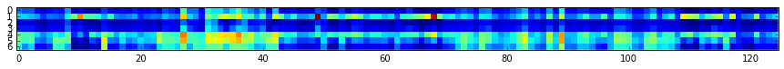

.. code:: python

    sensor = 'sentinel2'
    # plot in order of band numbers, not necessarily in order of their centre wavelengths...
    plt.figure(figsize=(15,3))
    plt.imshow(integrated_spectra[sensor]['integrefl'].T, interpolation='none')
    plt.show()

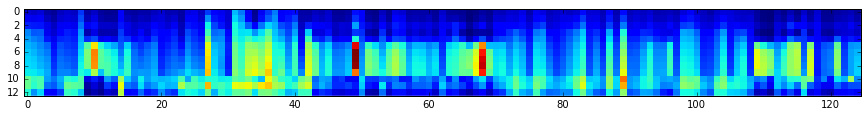

For one sensor, plot the integrated reflectance (i.e. vegetation
spectrum integrated over the sensor bandpasses).

.. code:: python

    sensor = 'sentinel2'
    plt.figure(figsize=(15,3))
    for i in range(0, m, 10): # pick some vegetation spectra
        # sort the second dimenions of our integrefl array w.r.t. cwls
        cwls = integrated_spectra[sensor]['cwls']
        e = np.argsort(cwls)
        integrefl = integrated_spectra[sensor]['integrefl'][i,:]
        plt.plot( cwls[e], integrefl[e])
        plt.plot( cwls[e], integrefl[e], '+' )
    plt.xlim(cwls[e][0],cwls[e][-1])
    plt.show()

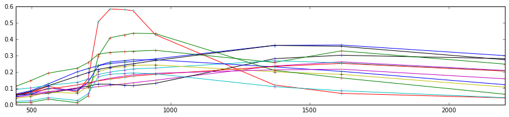

For one specific vegetation spectrum, plot the reflectance integrated
over the sensor bandpasses for all sensor-band combinations.

.. code:: python

    spect_no = 10
    plt.figure(figsize=(15,3))
    plt.plot(swl, spect[spect_no,:], 'k-')
    
    for sensor in ['meris', 'terra', 'aqua', 'sentinel2', 'vgt']:
        # do some sorting of the second dimension of our integrefl array
        cwls = integrated_spectra[sensor]['cwls']
        e = np.argsort(cwls)
        integrefl = integrated_spectra[sensor]['integrefl'][spect_no,:]
        cwls = cwls[e]
        integrefl = integrefl[e]    
        plt.plot(cwls, integrefl, 'o', label=sensor)
    plt.xlim(cwls[e][0],cwls[e][-1])
    plt.legend()
    plt.show()

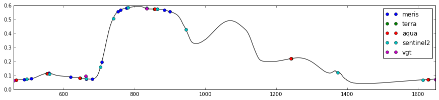

.. code:: python

    # save
    fl = open('./../dump/integrated_spectra/integrated_spectra.dump', 'w')
    pickle.dump(integrated_spectra, fl)
    fl.close()

A5.4 Finding linear mappings for the different sensors
------------------------------------------------------

In this section, we develop the set of linear mapping functions.

These are texsted with a subset of the data (27 samples), with the resul
used for training.

.. code:: python

    def fit(X, y):
        # solve normal equations
        beta_hat = (X.T * X).I * X.T * y
        
        # estimate y given X
        y_hat = X * beta_hat
        
        # compute the variance of y given X, var(y|X) = var(epsilon|X)
        e = y - y_hat
        var_y_given_X = np.std(e)**2 # this value is the sum (product?) of the
        # conditional variance and the variance that results from not knowing
        # the true values of beta
        return beta_hat, var_y_given_X
    
    def evaluate(Xnew, X, beta_hat, var_y_given_X):
        # evaluate the model at values in Xnew
        y_pred = Xnew * beta_hat
        
        # compute variance of 
        u = var_y_given_X * (1.0 + Xnew * (X.T * X).I * Xnew.T)
        var_pred = np.diag(u)
        
        return y_pred, var_pred
    
    # copied from: http://adorio-research.org/wordpress/?p=1932
    def AIC(RSS, k, n):
        """
        Computes the Akaike Information Criterion.
     
           RSS-residual sum of squares of the fitting errors.
           k  - number of fitted parameters.
           n  - number of observations.
        """
        AIC = 2 * k + n * (np.log(2 * np.pi * RSS/n) + 1)
        return AIC

.. code:: python

    fn = './../dump/integrated_spectra/integrated_spectra.dump'
    fl = open(fn, 'r')
    integrated_spectra = pickle.load(fl)
    fl.close()

.. code:: python

    # Create sets of test and training data
    test_size = 27
    
    n = 125 # number of observations or spectra in the DLR database
    training_size = n - test_size
    spectrum_numbers = np.arange(n)
    training_idxs = np.sort( np.random.choice(n, size=training_size, replace=False ) ).astype(int)
    test_idxs = np.delete(spectrum_numbers, training_idxs)
    
    print 'training', training_idxs
    print ''
    print 'testing', test_idxs

.. parsed-literal::

    training [  0   1   4   6   7   8   9  10  11  12  13  14  15  16  17  18  19  20
      21  22  23  24  26  27  30  34  35  36  37  40  41  43  44  45  46  49
      50  51  52  53  54  55  57  59  62  63  64  65  66  67  68  69  70  72
      73  74  75  76  77  78  79  80  81  82  83  84  85  86  89  91  92  93
      94  96  97  98  99 100 102 103 104 105 106 107 108 109 110 112 113 114
     115 116 119 120 121 122 123 124]
    
    testing [  2   3   5  25  28  29  31  32  33  38  39  42  47  48  56  58  60  61
      71  87  88  90  95 101 111 117 118]

.. code:: python

    # for a given sensor A
    # ... for a given band
    # ... ... for another given sensor B
    # ... ... ... compute distance (wavelength) between bands of B to the selected band of A
    # ... ... ... build linear models that map bands of B to the band of A, always include bands nearer to the selected band of A
    # ... ... ... compute an information criterion, e.g. Akaike's index
    # ... ... ... store everything in a dictionary format
    
    mappings = {}
    
    sensors = ['terra', 'aqua', 'meris', 'sentinel2', 'vgt']
    for sensorA in sensors:
        print sensorA
        
        cwlsA = integrated_spectra[sensorA]['cwls']
        mappings[sensorA] = {}
        
        for bandA, cwlA in enumerate(cwlsA):
            # get observations y that we want to map to
            integreflA = integrated_spectra[sensorA]['integrefl']
            y = np.matrix( integreflA[training_idxs,:][:,bandA] ).T
            mappings[sensorA][bandA] = {}
    
            for sensorB in sensors:
                if sensorA == sensorB:
                    continue
                
                mappings[sensorA][bandA][sensorB] = {}
                
                # compute distance between band of sensorA and bands of sensorB
                cwlsB = integrated_spectra[sensorB]['cwls']
                dist = cwlsB - cwlA
                e = np.argsort(dist)
                
                # build design matrices X with band observation of sensorB
                integreflB = integrated_spectra[sensorB]['integrefl']
                aic_previous = np.inf
                for i in range(1, len(e)+1): # test the first five bands
                    bandsB = e[0:i]
                    k = len(bandsB) # number of fitted parameters
                    assert np.shape(integreflB)[0] == np.shape(integreflA)[0]
                    X_ = integreflB[training_idxs,:][:,bandsB] # of shape number of training samples x number of bands considered in linear regression
                    
                    X = np.matrix( np.hstack(( np.ones(training_size).reshape((training_size, 1)), X_ )) )
                    # should we apply some weighting? and how?
                    beta_hat, var_y_given_X = fit(X, y)
                    y_pred, var_pred = evaluate(X, X, beta_hat, var_y_given_X)
                    RSS = (y_pred - y).T * (y_pred - y)
                    aic = float(AIC(RSS, k, n))
                    
                    if aic < aic_previous:
                        mappings[sensorA][bandA][sensorB] = {'bandsB':bandsB, 'cwls':cwlsB[bandsB], \
                                                       'beta_hat':beta_hat, 'AIC':aic, 'var_y_given_X': var_y_given_X}
                        aic_previous = aic
    

.. parsed-literal::

    terra
    aqua
    meris
    sentinel2
    vgt

Part of the quality assurance here is that the test samples should
mostly lie within the confidence interval.

.. code:: python

    sensorA = 'sentinel2'
    bandA = 9
    sensorB = 'vgt'
    
    cwlA = integrated_spectra[sensorA]['cwls'][bandA]
    y = integrated_spectra[sensorA]['integrefl'][:,bandA]
    
    integreflB = integrated_spectra[sensorB]['integrefl']
    bandsB = mappings[sensorA][bandA][sensorB]['bandsB']
    var_y_given_X = mappings[sensorA][bandA][sensorB]['var_y_given_X']
    beta_hat = mappings[sensorA][bandA][sensorB]['beta_hat']
    
    X_ = integreflB[:, bandsB]
    X = np.matrix( np.hstack(( np.ones( np.shape(X_)[0] ).reshape(( np.shape(X_)[0], 1)), X_ )) ) # create design matrix
    
    y_pred, var_y = evaluate(X, X, beta_hat, var_y_given_X)
    
    c = 0
    for i in test_idxs:
        yp = float(y_pred[i,0])
        sigma = np.sqrt(float(var_y[i]))
        t = 1.96
        bln = (y[i] > (yp - (t * sigma))) and (y[i] < (yp + (t * sigma)))
        #print i, y[i], yp - yvar, yp + yvar, bln
        if bln:
            c+=1
    
    print 'There were', c, 'positives out of', test_size, 'or %.2f' % (float(c)/float(test_size)*100.0), \
                        '% of observations fell within confidence interval'

.. parsed-literal::

    There were 27 positives out of 27 or 100.00 % of observations fell within confidence interval

Here, we provide examples of the mapping from Sentinel-2 bands to MODIS:

.. code:: python

    # define here sensorA and sensorB
    # sensorA is the one to map to using band observations from sensorB
    sensorA = 'terra'
    sensorB = 'sentinel2'
    
    # for 27 randomly selected spectra from the DLR database...
    nrows = 6 # for image display
    ncols = 3 # for image display
    fig = plt.figure( figsize = (15, 20))
    num_subplots = nrows * ncols
    
    for i, spectrum_number in enumerate(test_idxs[:num_subplots]):
        cwlsA = integrated_spectra[sensorA]['cwls']
        m = len(cwlsA) # m number of bands in sensorA
        bandsA = range(m)
        spectrum = np.zeros((m, 4), dtype=float)
        for bandA in bandsA:
            cwlA = integrated_spectra[sensorA]['cwls'][bandA]
            y = integrated_spectra[sensorA]['integrefl'][:,bandA]
    
            integreflB = integrated_spectra[sensorB]['integrefl']
            bandsB = mappings[sensorA][bandA][sensorB]['bandsB']
            var_y_given_X = mappings[sensorA][bandA][sensorB]['var_y_given_X']
            beta_hat = mappings[sensorA][bandA][sensorB]['beta_hat']
    
            X_ = integreflB[:, bandsB]
            X = np.matrix( np.hstack(( np.ones( np.shape(X_)[0] ).reshape(( np.shape(X_)[0], 1)), X_ )) ) # create design matrix
    
            y_pred, var_y = evaluate(X, X, beta_hat, var_y_given_X)
    
            yp = float(y_pred[spectrum_number,0]) # y_pred is a column vector, we still index in full 2 dimensions...
            sigma = np.sqrt(float(var_y[spectrum_number]))
            t = 1.96
            y_lower = yp - (t * sigma)
            y_upper = yp + (t * sigma)
    
            spectrum[bandA, :] = y_lower, yp, y_upper, sigma
        
        # plot in order of centre wavelengths
        e = np.argsort(cwlsA)
        ax = fig.add_subplot(nrows, ncols, i+1)
    
        ax.set_ylim((0, 0.6))
        ax.locator_params(axis='y',nbins=4)
        if i+1 > 3:
            for tick in ax.xaxis.get_major_ticks():
                tick.label.set_fontsize(20)
            ax.set_xlabel("wavelength (nm)", fontsize=20)
        else:
            ax.set_xticklabels( () )
    
        
        if i+1 == 1 or i+1 == 4:
            for tick in ax.yaxis.get_major_ticks():
                    tick.label.set_fontsize(20)
            ax.set_ylabel("reflectance", fontsize=20)
        else:
            ax.set_yticklabels(())
        
        plt.plot(cwlsA[e], integrated_spectra[sensorA]['integrefl'][spectrum_number, e], 'o', alpha=0.3)
        plt.errorbar(cwlsA[e], spectrum[e,1], yerr=1.96*spectrum[e,3], fmt='.', color='black')
        # in case you may want to interpolate between bands...
        plt.plot(cwlsA[e], spectrum[e,1], 'k-.')
        plt.fill_between(cwlsA[e], spectrum[e,0], spectrum[e,2], facecolor='grey', alpha = 0.3)
        plt.title('spec# %s' % spectrum_number)
        plt.locator_params(nbins=5)
        
    plt.tight_layout()
    plt.show() 
    

Here, we provide examples of the mapping from MODIS bands to Senstinel
2:

.. code:: python

    # define here sensorA and sensorB
    # sensorA is the one to map to using band observations from sensorB
    sensorB = 'terra'
    sensorA = 'sentinel2'
    
    # for 27 randomly selected spectra from the DLR database...
    nrows = 6 # for image display
    ncols = 3 # for image display
    fig = plt.figure( figsize = (15, 20))
    num_subplots = nrows * ncols
    
    for i, spectrum_number in enumerate(test_idxs[:num_subplots]):
        cwlsA = integrated_spectra[sensorA]['cwls']
        m = len(cwlsA) # m number of bands in sensorA
        bandsA = range(m)
        spectrum = np.zeros((m, 4), dtype=float)
        for bandA in bandsA:
            cwlA = integrated_spectra[sensorA]['cwls'][bandA]
            y = integrated_spectra[sensorA]['integrefl'][:,bandA]
    
            integreflB = integrated_spectra[sensorB]['integrefl']
            bandsB = mappings[sensorA][bandA][sensorB]['bandsB']
            var_y_given_X = mappings[sensorA][bandA][sensorB]['var_y_given_X']
            beta_hat = mappings[sensorA][bandA][sensorB]['beta_hat']
    
            X_ = integreflB[:, bandsB]
            X = np.matrix( np.hstack(( np.ones( np.shape(X_)[0] ).reshape(( np.shape(X_)[0], 1)), X_ )) ) # create design matrix
    
            y_pred, var_y = evaluate(X, X, beta_hat, var_y_given_X)
    
            yp = float(y_pred[spectrum_number,0]) # y_pred is a column vector, we still index in full 2 dimensions...
            sigma = np.sqrt(float(var_y[spectrum_number]))
            t = 1.96
            y_lower = yp - (t * sigma)
            y_upper = yp + (t * sigma)
    
            spectrum[bandA, :] = y_lower, yp, y_upper, sigma
        
        # plot in order of centre wavelengths
        e = np.argsort(cwlsA)
        ax = fig.add_subplot(nrows, ncols, i+1)
    
        ax.set_ylim((0, 0.6))
        ax.locator_params(axis='y',nbins=4)
        if i+1 > 3:
            for tick in ax.xaxis.get_major_ticks():
                tick.label.set_fontsize(20)
            ax.set_xlabel("wavelength (nm)", fontsize=20)
        else:
            ax.set_xticklabels( () )
    
        
        if i+1 == 1 or i+1 == 4:
            for tick in ax.yaxis.get_major_ticks():
                    tick.label.set_fontsize(20)
            ax.set_ylabel("reflectance", fontsize=20)
        else:
            ax.set_yticklabels(())
        
        plt.plot(cwlsA[e], integrated_spectra[sensorA]['integrefl'][spectrum_number, e], 'o', alpha=0.3)
        plt.errorbar(cwlsA[e], spectrum[e,1], yerr=1.96*spectrum[e,3], fmt='.', color='black')
        # in case you may want to interpolate between bands...
        plt.plot(cwlsA[e], spectrum[e,1], 'k-.')
        plt.fill_between(cwlsA[e], spectrum[e,0], spectrum[e,2], facecolor='grey', alpha = 0.3)
        plt.title('spec# %s' % spectrum_number)
        plt.locator_params(nbins=5)
        
    plt.tight_layout()
    plt.show() 
    

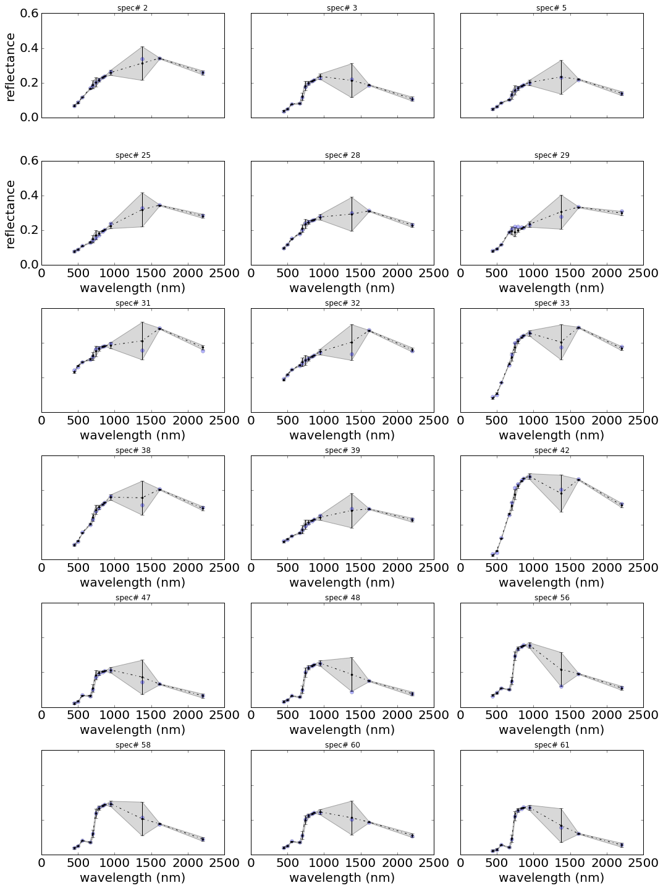

The illustrations show that with linear mapping functions derived from
this DLR spectral database, we can derive suitable mappings and
uncertainty quantification between any pairs of sensors. In the vase of
Sentinel-2 (S2) to MODIS, we note the relatively large uncertainties in
predicting MODIS bands 5 and 7 from S2 sampling, but that all
uncertainties arising from this are really quite small.

In the case of MODIS to S2 mapping, it is (again) only in the SWIR that
uncertainties become quite high.

.. code:: python

    # define here sensorA and sensorB
    # sensorA is the one to map to using band observations from sensorB
    sensorB = 'vgt'
    sensorA = 'meris'
    
    # for 27 randomly selected spectra from the DLR database...
    nrows = 6 # for image display
    ncols = 3 # for image display
    fig = plt.figure( figsize = (15, 20))
    num_subplots = nrows * ncols
    
    for i, spectrum_number in enumerate(test_idxs[:num_subplots]):
        cwlsA = integrated_spectra[sensorA]['cwls']
        m = len(cwlsA) # m number of bands in sensorA
        bandsA = range(m)
        spectrum = np.zeros((m, 4), dtype=float)
        for bandA in bandsA:
            cwlA = integrated_spectra[sensorA]['cwls'][bandA]
            y = integrated_spectra[sensorA]['integrefl'][:,bandA]
    
            integreflB = integrated_spectra[sensorB]['integrefl']
            bandsB = mappings[sensorA][bandA][sensorB]['bandsB']
            var_y_given_X = mappings[sensorA][bandA][sensorB]['var_y_given_X']
            beta_hat = mappings[sensorA][bandA][sensorB]['beta_hat']
    
            X_ = integreflB[:, bandsB]
            X = np.matrix( np.hstack(( np.ones( np.shape(X_)[0] ).reshape(( np.shape(X_)[0], 1)), X_ )) ) # create design matrix
    
            y_pred, var_y = evaluate(X, X, beta_hat, var_y_given_X)
    
            yp = float(y_pred[spectrum_number,0]) # y_pred is a column vector, we still index in full 2 dimensions...
            sigma = np.sqrt(float(var_y[spectrum_number]))
            t = 1.96
            y_lower = yp - (t * sigma)
            y_upper = yp + (t * sigma)
    
            spectrum[bandA, :] = y_lower, yp, y_upper, sigma
        
        # plot in order of centre wavelengths
        e = np.argsort(cwlsA)
        ax = fig.add_subplot(nrows, ncols, i+1)
    
        ax.set_ylim((0, 0.6))
        ax.locator_params(axis='y',nbins=4)
        if i+1 > 3:
            for tick in ax.xaxis.get_major_ticks():
                tick.label.set_fontsize(20)
            ax.set_xlabel("wavelength (nm)", fontsize=20)
        else:
            ax.set_xticklabels( () )
    
        
        if i+1 == 1 or i+1 == 4:
            for tick in ax.yaxis.get_major_ticks():
                    tick.label.set_fontsize(20)
            ax.set_ylabel("reflectance", fontsize=20)
        else:
            ax.set_yticklabels(())
        
        plt.plot(cwlsA[e], integrated_spectra[sensorA]['integrefl'][spectrum_number, e], 'o', alpha=0.3)
        plt.errorbar(cwlsA[e], spectrum[e,1], yerr=1.96*spectrum[e,3], fmt='.', color='black')
        # in case you may want to interpolate between bands...
        plt.plot(cwlsA[e], spectrum[e,1], 'k-.')
        plt.fill_between(cwlsA[e], spectrum[e,0], spectrum[e,2], facecolor='grey', alpha = 0.3)
        plt.title('spec# %s' % spectrum_number)
        plt.locator_params(nbins=5)
        
    plt.tight_layout()
    plt.show() 
    
    

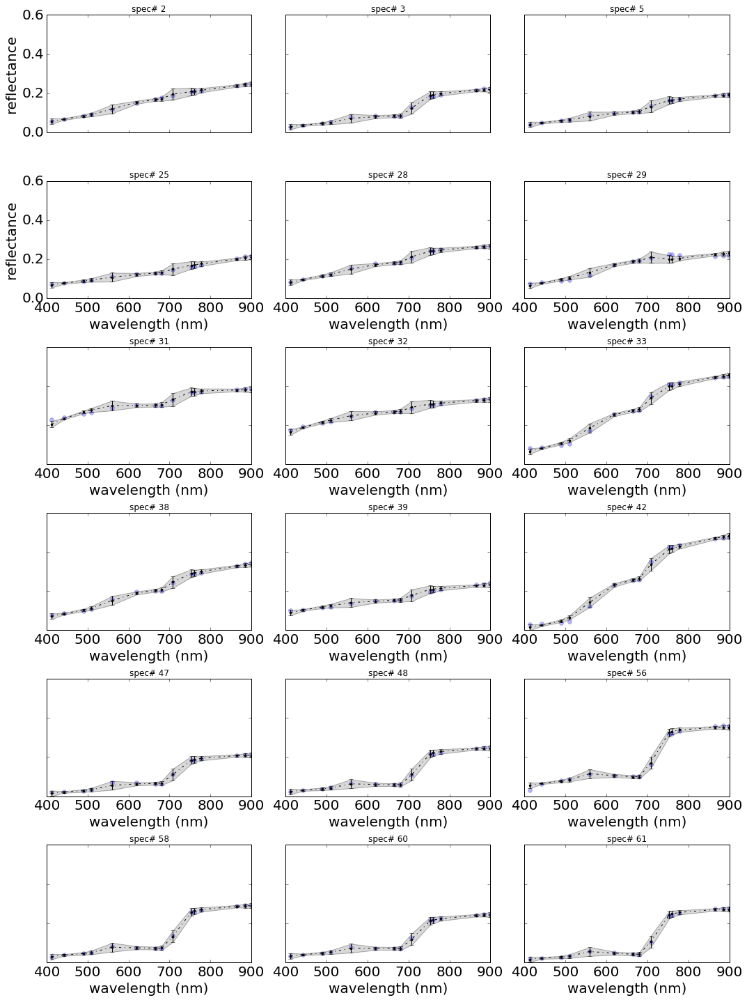

.. code:: python

    # define here sensorA and sensorB
    # sensorA is the one to map to using band observations from sensorB
    sensorA = 'vgt'
    sensorB = 'meris'
    
    # for 27 randomly selected spectra from the DLR database...
    nrows = 6 # for image display
    ncols = 3 # for image display
    fig = plt.figure( figsize = (15, 20))
    num_subplots = nrows * ncols
    
    for i, spectrum_number in enumerate(test_idxs[:num_subplots]):
        cwlsA = integrated_spectra[sensorA]['cwls']
        m = len(cwlsA) # m number of bands in sensorA
        bandsA = range(m)
        spectrum = np.zeros((m, 4), dtype=float)
        for bandA in bandsA:
            cwlA = integrated_spectra[sensorA]['cwls'][bandA]
            y = integrated_spectra[sensorA]['integrefl'][:,bandA]
    
            integreflB = integrated_spectra[sensorB]['integrefl']
            bandsB = mappings[sensorA][bandA][sensorB]['bandsB']
            var_y_given_X = mappings[sensorA][bandA][sensorB]['var_y_given_X']
            beta_hat = mappings[sensorA][bandA][sensorB]['beta_hat']
    
            X_ = integreflB[:, bandsB]
            X = np.matrix( np.hstack(( np.ones( np.shape(X_)[0] ).reshape(( np.shape(X_)[0], 1)), X_ )) ) # create design matrix
    
            y_pred, var_y = evaluate(X, X, beta_hat, var_y_given_X)
    
            yp = float(y_pred[spectrum_number,0]) # y_pred is a column vector, we still index in full 2 dimensions...
            sigma = np.sqrt(float(var_y[spectrum_number]))
            t = 1.96
            y_lower = yp - (t * sigma)
            y_upper = yp + (t * sigma)
    
            spectrum[bandA, :] = y_lower, yp, y_upper, sigma
        
        # plot in order of centre wavelengths
        e = np.argsort(cwlsA)
        ax = fig.add_subplot(nrows, ncols, i+1)
    
        ax.set_ylim((0, 0.6))
        ax.locator_params(axis='y',nbins=4)
        if i+1 > 3:
            for tick in ax.xaxis.get_major_ticks():
                tick.label.set_fontsize(20)
            ax.set_xlabel("wavelength (nm)", fontsize=20)
        else:
            ax.set_xticklabels( () )
    
        
        if i+1 == 1 or i+1 == 4:
            for tick in ax.yaxis.get_major_ticks():
                    tick.label.set_fontsize(20)
            ax.set_ylabel("reflectance", fontsize=20)
        else:
            ax.set_yticklabels(())
        
        plt.plot(cwlsA[e], integrated_spectra[sensorA]['integrefl'][spectrum_number, e], 'o', alpha=0.3)
        plt.errorbar(cwlsA[e], spectrum[e,1], yerr=1.96*spectrum[e,3], fmt='.', color='black')
        # in case you may want to interpolate between bands...
        plt.plot(cwlsA[e], spectrum[e,1], 'k-.')
        plt.fill_between(cwlsA[e], spectrum[e,0], spectrum[e,2], facecolor='grey', alpha = 0.3)
        plt.title('spec# %s' % spectrum_number)
        plt.locator_params(nbins=5)
        
    plt.tight_layout()
    plt.show() 
    
    
    

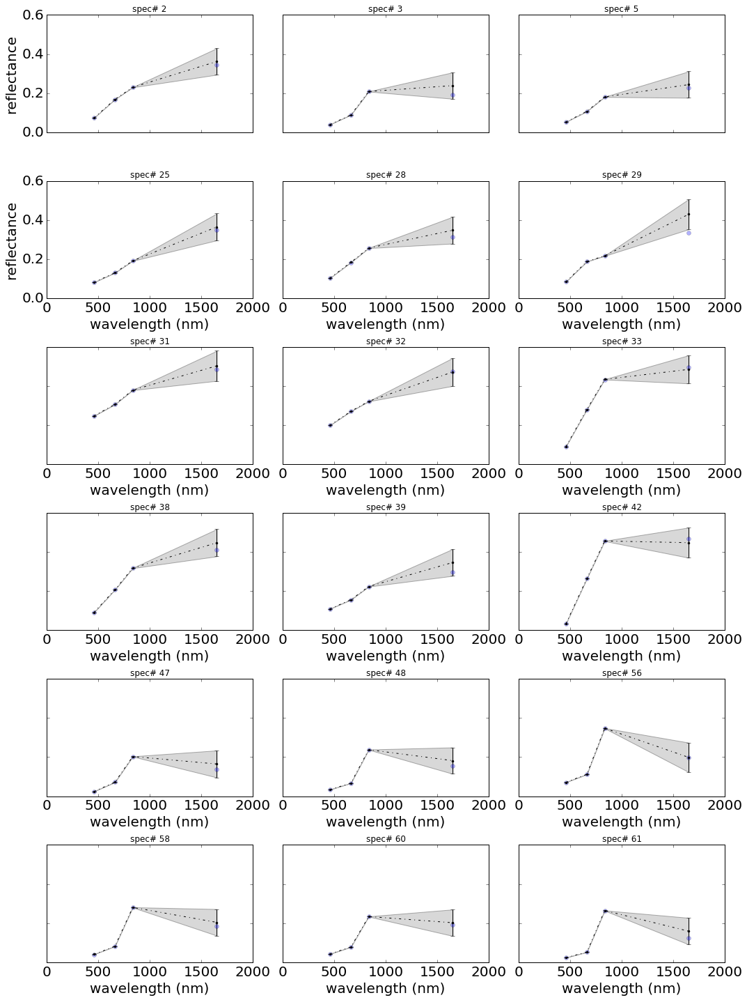

Similarly, looking at the mappings from VGT to MERIS, we see that the
uncertainty inb mapping from VGT to MERIS is quite small, but when
mapping from MERIS to VGT, the uncertainty in the SWIR becomes large.
This is because MERIS has no spectral sampling in this region, and the
mapping is enavbled simply by correlations in the data.

This is very positive for the approach developed here, as it
demonstrates that we can achive sensible spectral mappings between
datasets from sensors with different spectral sampling. Where the
wavebands of the two sensors are close, we tend to get low
uncertainties. In extrapolation (as in the MERIS to VGT case) the
uncertainty can be quite high, but that is appropriate:
pseudo-observations at such wavelengths will then have low weight in
constraining albedo.
